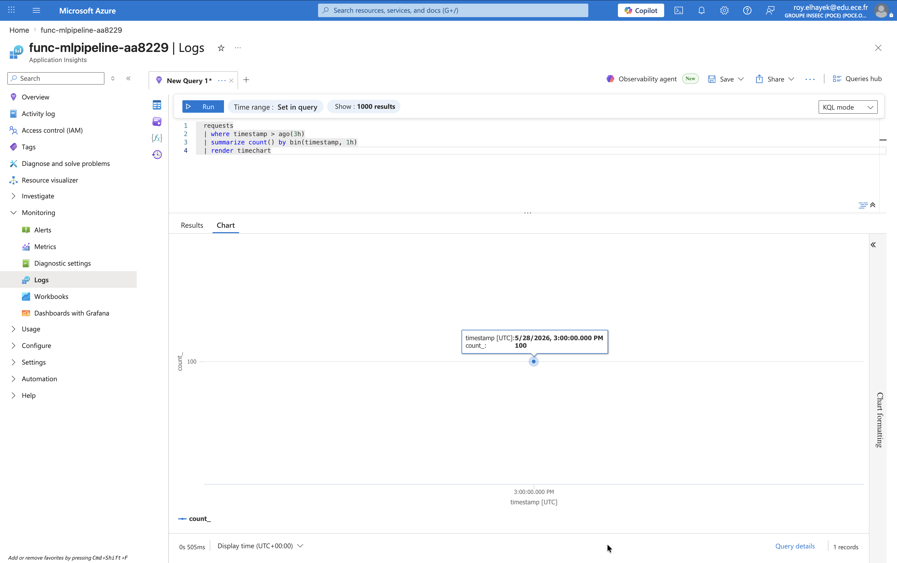
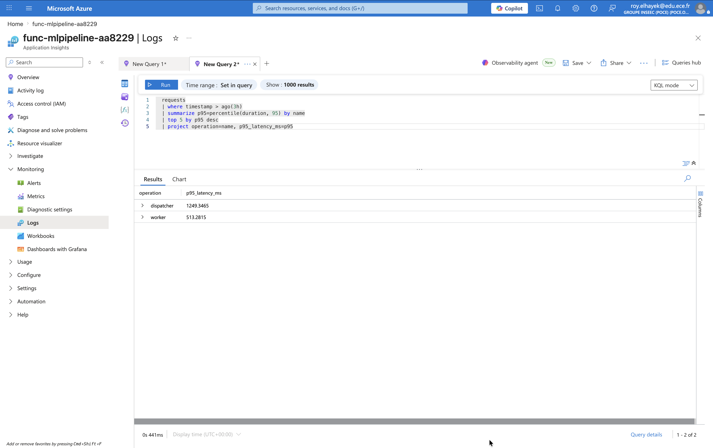
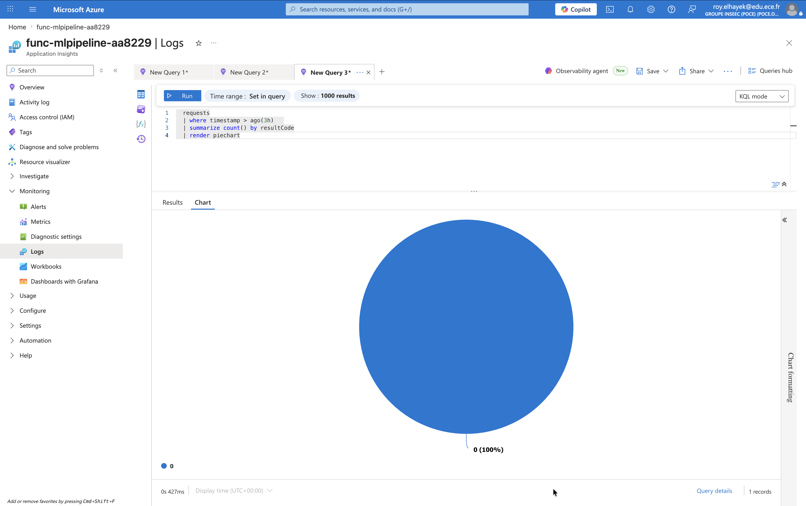

# Event-Driven Machine Learning Pipeline on Azure

> ECE Paris - Distributed Systems & AI - 5th year integrative project

An end-to-end **serverless, event-driven ML pipeline** deployed on Microsoft Azure.  
A user uploads a weather CSV to Blob Storage; the pipeline validates, processes, and runs
inference via a containerised ML API, then persists results in Cosmos DB and visualises
them on a Static Web App dashboard.

---

## Architecture

```
1. Blob Storage        →  2. Event Grid + Function  →  3. Storage Queue
   (input/)               Validation & dispatch          Decoupling & retries

                                                              ↓
8. Static Web App  ←  7. Cosmos DB  ←  6. Blob output/  ←  4. Worker Function
   Results dashboard      Free Tier        JSON results        ML API call
                                                              ↓
                                                         5. ML API
                                                    Docker · Container Apps
```

> Full architecture diagram: [`docs/architecture.md`](docs/architecture.md)

---

## Dataset & ML task

| Property        | Value |
|-----------------|-------|
| Dataset         | [Szeged Weather 2006-2016](https://www.kaggle.com/datasets/budincsevity/szeged-weather) (Kaggle) |
| Source          | `kaggle datasets download -d budincsevity/szeged-weather` |
| Size            | ~10 MB, ~96 k hourly records |
| Task            | Regression — predict **apparent temperature (°C)** |
| Features        | `temperature_c`, `humidity`, `wind_speed_kmh`, `wind_bearing_deg` (sin/cos), `visibility_km`, `pressure_mb`, `is_rain`, `hour` (sin/cos), `month` (sin/cos) |
| Model           | Gradient Boosting Regressor (scikit-learn) |
| Export format   | `model_v1.0.0.pkl` (joblib) |
| Random seed     | `42` |

### Metrics (test set, 20 % hold-out)

| Metric | Value (19 033-row test set, 20% hold-out) |
|--------|-------------------------------------------|
| RMSE   | 0.087 °C |
| MAE    | 0.055 °C |
| R²     | 0.9999 |

> **Reproduce**: `cd model && pip install -r requirements.txt && python data/download_data.py && python train.py`

---

## Repository structure

```
├── api/                  FastAPI inference service
│   ├── main.py
│   ├── Dockerfile
│   ├── requirements.txt
│   └── tests/
├── functions/            Azure Functions (dispatcher + worker + http-api)
├── model/                Training script, exported model, data
├── web/                  Static Web App (HTML/JS dashboard)
├── .github/workflows/    CI and CD pipelines
├── tests/                End-to-end integration tests
└── docs/                 Architecture diagram, KQL queries, schemas
```

---

## Quickstart (local)

### Prerequisites
- Python ≥ 3.11, Docker Desktop, Azure CLI, Azure Functions Core Tools v4

```bash
# 1. Download data and train the model
cd model && pip install -r requirements.txt && python data/download_data.py && python train.py

# 2. Run the ML API locally
cd api && pip install -r requirements.txt
MODEL_PATH=../model/model_v1.0.0.pkl uvicorn main:app --reload

# 3. Test the API
curl http://localhost:8000/health
curl http://localhost:8000/version
curl -X POST http://localhost:8000/predict \
  -H "Content-Type: application/json" \
  -d '{"records":[{"temperature_c":18.5,"humidity":0.72,"wind_speed_kmh":14.3,
       "wind_bearing_deg":180,"visibility_km":9.5,"pressure_mb":1012.4,
       "is_rain":0,"hour":14,"month":6}]}'
```

---

## Azure deployment

See [`docs/deployment.md`](docs/deployment.md) for full step-by-step `az` commands.

Key GitHub Secrets required before running the CD workflow:

| Secret | Description |
|--------|-------------|
| `AZURE_CLIENT_ID` | Service principal client ID (OIDC) |
| `AZURE_TENANT_ID` | Azure tenant ID |
| `AZURE_SUBSCRIPTION_ID` | Azure subscription ID |
| `ACR_LOGIN_SERVER` | e.g. `acrXXXXXX.azurecr.io` |
| `ACR_NAME` | Registry name without domain |

### Note on Static Web App deployment

The React dashboard (`/web`) is built with Vite and is fully production-ready
(`npm run build` produces a static `dist/` bundle that can be served by any
static host). However, **Azure Static Web Apps could not be deployed in this
project** because of two stacked restrictions:

1. `Microsoft.Web/staticSites` is only available in 5 Azure regions worldwide:
   `centralus`, `eastus2`, `westus2`, `westeurope`, `eastasia`.
2. Our **Azure for Students subscription policy blocks all 5 of those regions**
   (`RequestDisallowedByAzure` is returned for every create attempt).

The dashboard is therefore documented and demonstrated locally. To run it
against the live Azure backend:

```bash
cd web
npm ci
VITE_API_URL="https://func-mlpipeline-aa8229.azurewebsites.net" npm run dev
# Open http://localhost:5173
```

The Vite dev server proxies `/api/recent` to the live Azure Function, so the
dashboard shows real Cosmos DB data including HuggingFace summaries and the
multi-region read latency. On a regular (non-Student) subscription, deployment
to the actual Azure Static Web App resource is a single command:

```bash
az staticwebapp create \
  --name swa-mlpipeline --resource-group rg-mlpipeline-prod \
  --location westeurope --sku Free
```

See [`docs/deployment.md`](docs/deployment.md#8---bonus-frontend-on-static-web-app)
for the full SWA deployment script.

---

## API reference

### POST /predict

**Request**
```json
{
  "records": [
    {
      "temperature_c": 18.5,
      "humidity": 0.72,
      "wind_speed_kmh": 14.3,
      "wind_bearing_deg": 180,
      "visibility_km": 9.5,
      "pressure_mb": 1012.4,
      "is_rain": 0,
      "hour": 14,
      "month": 6
    }
  ]
}
```

**Response**
```json
{
  "predictions": [75.3],
  "model_version": "1.0.0",
  "processing_time_ms": 14
}
```

---

## Event Grid payload example

```json
{
  "topic": "/subscriptions/{sub}/resourceGroups/rg-project/providers/Microsoft.Storage/storageAccounts/stproject",
  "subject": "/blobServices/default/containers/input/blobs/weather_2024_01_15.csv",
  "eventType": "Microsoft.Storage.BlobCreated",
  "data": {
    "api": "PutBlob",
    "blobType": "BlockBlob",
    "url": "https://stproject.blob.core.windows.net/input/weather_2024_01_15.csv",
    "contentLength": 2048
  }
}
```

## Storage Queue message example

```json
{
  "blob_name": "weather_2024_01_15.csv",
  "blob_url": "https://stproject.blob.core.windows.net/input/weather_2024_01_15.csv",
  "content_type": "text/csv",
  "size_bytes": 2048,
  "enqueued_at": "2024-01-15T10:30:00Z"
}
```

---

## KQL queries

### 1 — Inference count per hour
```kusto
requests
| where timestamp > ago(3h)
| summarize count() by bin(timestamp, 1h)
| render timechart
```



### 2 — Top 5 slowest operations (p95 latency)
```kusto
requests
| where timestamp > ago(3h)
| summarize p95=percentile(duration, 95) by name
| top 5 by p95 desc
| project operation=name, p95_latency_ms=p95
```



### 3 — HTTP status code distribution
```kusto
requests
| where timestamp > ago(3h)
| summarize count() by resultCode
| render piechart
```



---

## Monthly cost estimate

| Service | SKU | Est. cost/month |
|---------|-----|-----------------|
| Azure Functions | Consumption | ~$0 (1M free) |
| Storage (blobs + queue) | LRS Standard | ~$0.02 |
| Container Apps | Consumption, 0 min replicas | ~$1-3 |
| ACR | Basic | ~$5 |
| Cosmos DB | Free Tier | $0 |
| Event Grid | <100k ops | $0 |
| Application Insights | <5 GB/month | $0 |
| Static Web App | Free | $0 |
| **Total** | | **~$6-8/month** |

---

## Team

| Name | GitHub |
|------|--------|
| Roy Hayek | [@royhayek](https://github.com/royhayek) |
| Dhia Rekik | [@dhia-rek](https://github.com/dhia-rek) |
| Mohamed Liratni | [@Mohamad-Liratni](https://github.com/Mohamad-Liratni) |
| Imane El Omary | [@ElOmaryimane](https://github.com/ElOmaryimane) |
