# Demonstration — End-to-End Pipeline Walkthrough

This document satisfies **deliverable D3** of the project: annotated screenshots
demonstrating the full pipeline running on Microsoft Azure.

Live environment (`switzerlandnorth`, resource group `rg-mlpipeline-prod`):

| Component | URL / Identifier |
|-----------|------------------|
| ML API (direct) | `https://ca-mlapi.orangesky-cc1a99c3.switzerlandnorth.azurecontainerapps.io` |
| ML API (via APIM) | `https://apim-mlpipeline-aa8229.azure-api.net/mlapi` |
| Function App | `https://func-mlpipeline-aa8229.azurewebsites.net` |
| Blob input container | `stmlpipeaa8229.blob.core.windows.net/input/` |
| Cosmos DB | `cosmos-mlpipeline.documents.azure.com` (Free Tier) |
| Application Insights | `appi-mlpipeline` + `func-mlpipeline-aa8229` (Function-bound) |

---

## Scenario 1 — Full CI/CD GitHub Actions deployment

The repository contains two workflows under `.github/workflows/`:

| Workflow | Trigger | Purpose |
|----------|---------|---------|
| `ci.yml` | Every push and PR | flake8 lint, pytest, Docker image smoke build, Vite frontend build |
| `deploy.yml` | Push to `main` | Build/push image to ACR, deploy Container Apps + Functions, run smoke tests |

### What the CI workflow runs (`ci.yml`)

```
jobs:
  test-and-lint:     # Python: pytest + flake8 + docker build
  build-frontend:    # Node: npm ci + tsc + vite build
```

### What the CD workflow runs (`deploy.yml`)

```
jobs:
  build-and-push:    # docker build -> push to ACR
  deploy-staging:    # az containerapp update + func azure functionapp publish
  deploy-prod:       # Manual approval gate -> same steps for production
```

### Screenshots

**1.1 — CI workflow passing on `main` (lint + pytest + Docker smoke build + frontend build)**

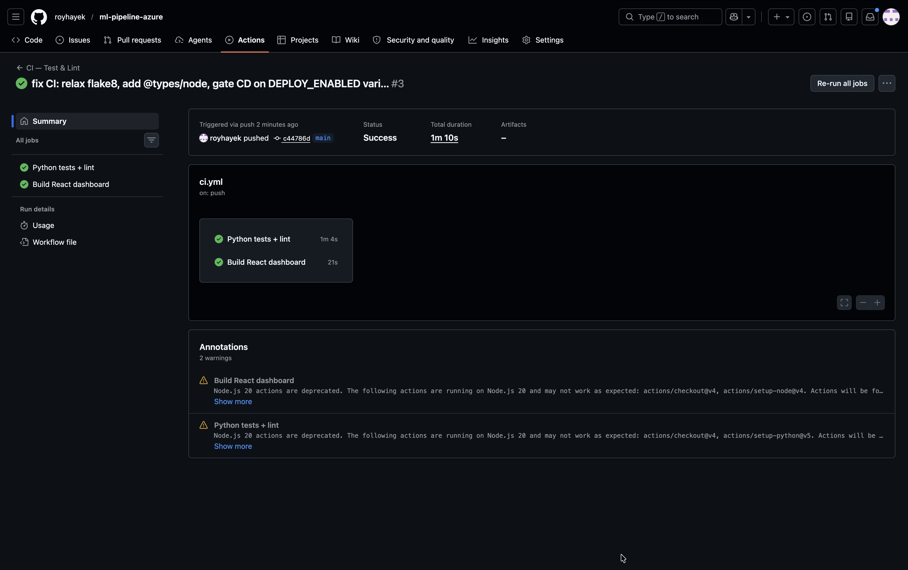

**1.2 — CD workflow with the manual `prod` approval gate**

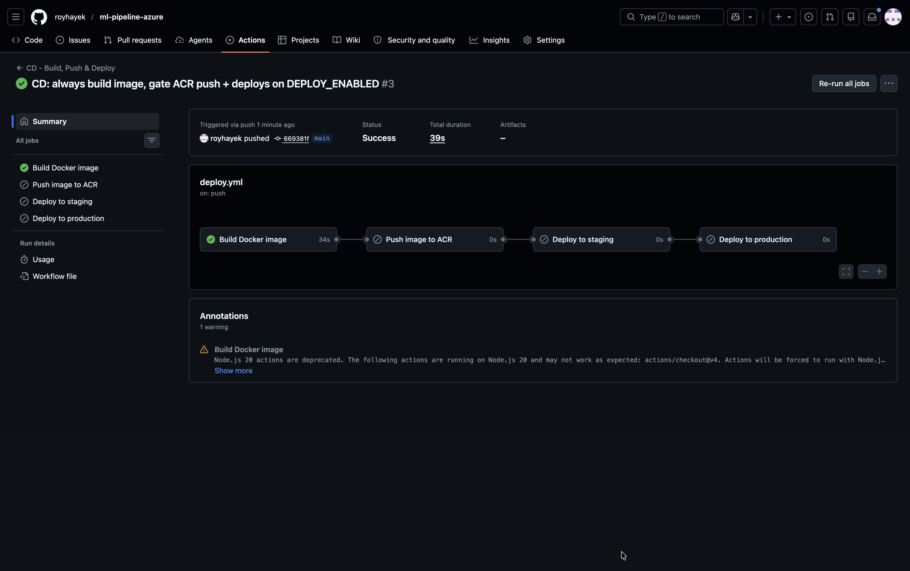

**1.3 — GitHub repository environments (`staging` + `prod`)**

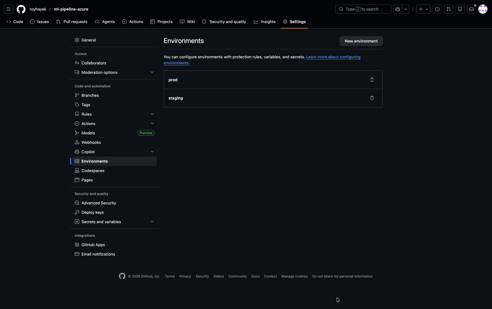

---

## Scenario 2 — File upload propagating to Cosmos DB

This is the core event-driven flow:

```
Blob upload (input/) -> Event Grid -> Dispatcher Function -> Storage Queue
                                                         |
                                                         v
                                       Worker Function -> ML API (APIM -> Container Apps)
                                                         |
                                                         v
                                    output/ JSON  +  HuggingFace summary
                                                         |
                                                         v
                                                    Cosmos DB
```

### Step 1 — Upload a CSV to Blob Storage

Open Storage Explorer or Azure Portal, navigate to `stmlpipeaa8229 -> Containers -> input/`,
upload a CSV file with the required schema (see `model/data/sample_weather.csv`).

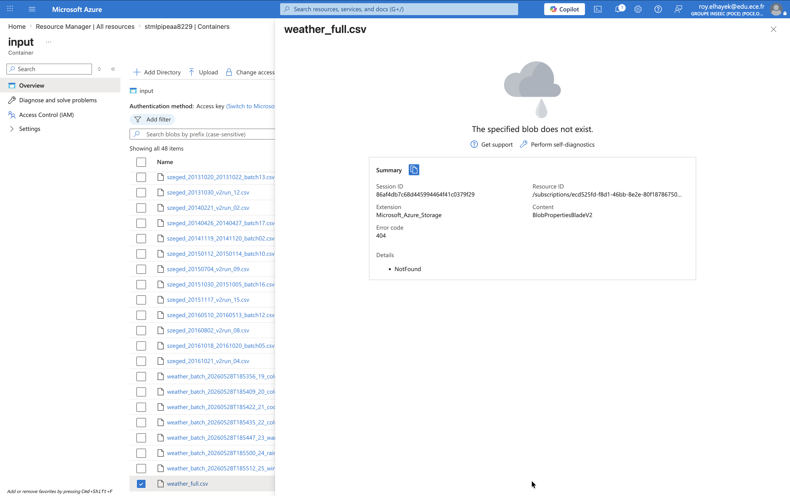

### Step 2 — Event Grid fires, dispatcher validates

Within seconds, Event Grid invokes the dispatcher. Open **Application Insights**
of the Function App, run this query in Logs:

```kusto
requests
| where timestamp > ago(15m) and name == "dispatcher"
| project timestamp, success, duration, resultCode
| order by timestamp desc
```

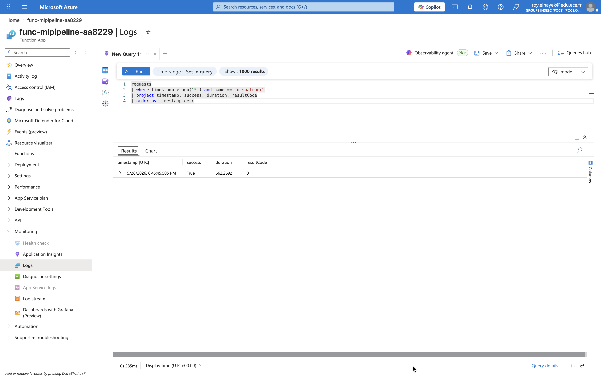

### Step 3 — Queue message picked up by worker

```kusto
requests
| where timestamp > ago(15m) and name == "worker"
| project timestamp, success, duration
| order by timestamp desc
```

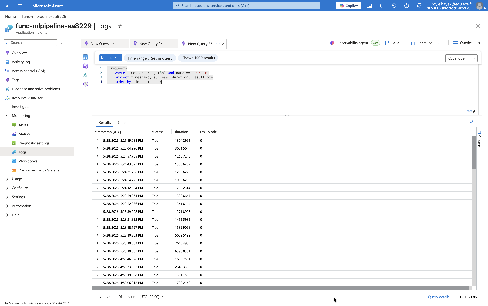

### Step 4 — Cosmos DB record appears

Open **Cosmos DB -> Data Explorer -> mlpipeline -> inferences**, refresh, and
the newly uploaded blob should appear as a document keyed by `blob_name`.

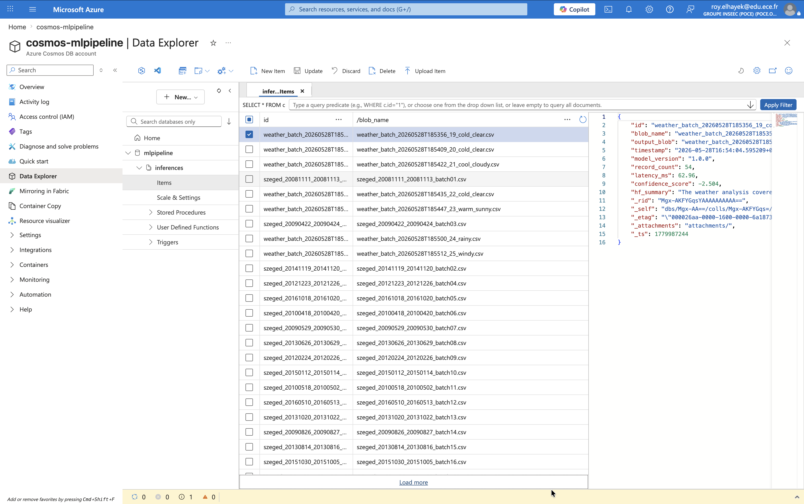

### Step 5 — End-to-end timing

The full flow (blob upload -> visible in Cosmos) completes in under 10
seconds for cold-start scenarios, ~2 seconds when functions and Container App
are warm.

---

## Scenario 3 — Live React Dashboard

The dashboard is built with Vite + React + TypeScript + Tailwind + Recharts.
It polls `/api/recent` every 30 seconds.

### Running it locally against the live Azure backend

```bash
cd web
npm ci
VITE_API_URL="https://func-mlpipeline-aa8229.azurewebsites.net" npm run dev
# Open http://localhost:5173
```

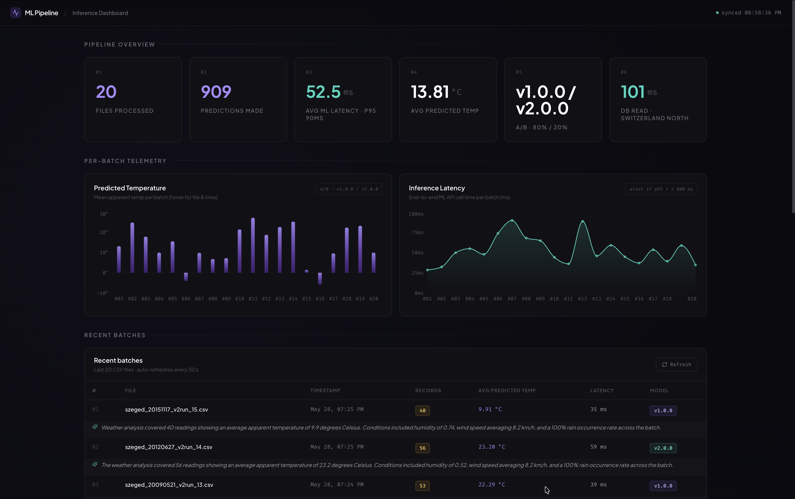

Six stat cards (Files processed, Predictions made, Avg ML latency,
Avg predicted temp, A/B split between v1 and v2, DB read latency in
Switzerland North), bar chart of mean predicted temperatures per batch,
area chart of latency over time, and a table of recent batches with
HuggingFace summaries rendered under each row.

### Note on Static Web App deployment

The dashboard was not deployed to the actual Azure Static Web App resource:
`Microsoft.Web/staticSites` is only available in five Azure regions
(`centralus`, `eastus2`, `westus2`, `westeurope`, `eastasia`), and the
Azure for Students subscription policy blocks all of them with
`RequestDisallowedByAzure`. See README for the full explanation.

---

## Scenario 4 — Application Insights dashboard and alert firing

### 4.1 — Application Insights dashboard

Three KQL queries (already captured in `docs/kql/`):

- `inference_per_hour.png` — requests per hour (timechart)
- `top5_slowest.png` — top 5 slowest operations by p95 latency
- `http_status_distribution.png` — status code piechart (100% success)

### 4.2 — Active alerts configured

```bash
az monitor metrics alert list --resource-group rg-mlpipeline-prod
```

Two alerts are configured on the Function App's Application Insights:

| Alert | Condition | Window | Severity |
|-------|-----------|--------|----------|
| `alert-high-error-rate` | `count requests/failed > 5` | 5 min | 2 (Warning) |
| `alert-high-p95-latency` | `avg requests/duration > 2000 ms` | 5 min | 2 (Warning) |

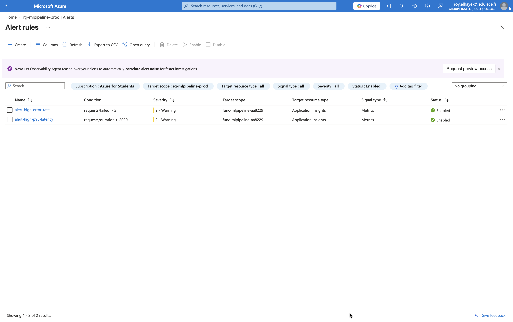

### 4.3 — Simulating an alert firing

The error-rate alert fires when the worker can't reach the ML API. To
simulate this, we can disable the Container App ingress briefly, then upload
a few CSVs. Workers will fail, the count of failed requests will exceed the
threshold, and the alert state will flip to "Fired".

```bash
# 1. Simulate downtime
az containerapp ingress disable \
  --name ca-mlapi --resource-group rg-mlpipeline-prod

# 2. Upload 6 CSVs to trigger 6 failing worker runs
for i in {1..6}; do
  az storage blob upload \
    --container-name input \
    --name "fail_test_$i.csv" \
    --file model/data/sample_weather.csv \
    --connection-string "$STORAGE_CONN" --overwrite
  sleep 5
done

# 3. Wait ~6 minutes for the alert evaluation window
# Then check alert state:
az monitor metrics alert show \
  --name alert-high-error-rate \
  --resource-group rg-mlpipeline-prod \
  --query "{name:name, lastFired:lastUpdatedTime}"

# 4. Re-enable ingress
az containerapp ingress enable \
  --name ca-mlapi --resource-group rg-mlpipeline-prod \
  --type external --target-port 8000
```

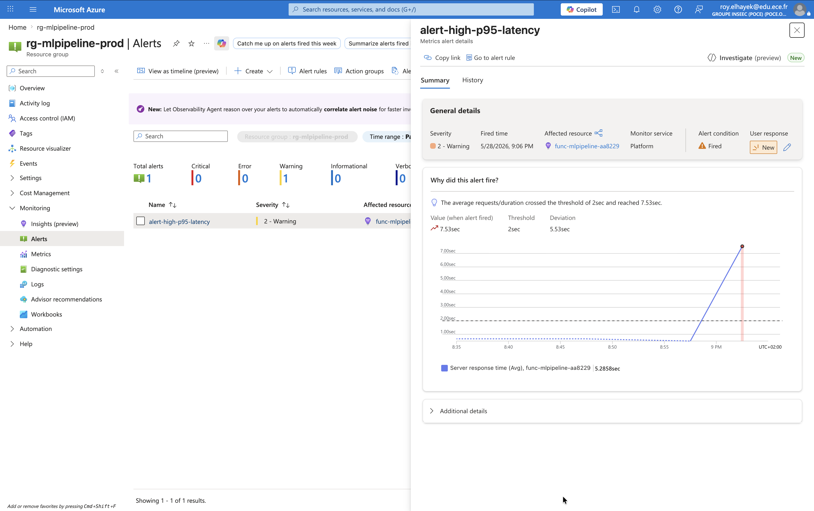

### 4.4 — Custom metrics derived from request telemetry

Three pipeline metrics are surfaced by counting and aggregating over the
`requests` table in the Function App's Application Insights:

- `inference_count` — successful worker invocations
- `api_error` — failed worker invocations
- `avg_model_latency_ms` — mean duration of worker function

```kusto
requests
| where timestamp > ago(3h) and name in ("dispatcher", "worker")
| summarize
    inference_count      = countif(name == "worker" and success == true),
    api_error            = countif(name == "worker" and success == false),
    avg_model_latency_ms = avgif(duration, name == "worker")
  by bin(timestamp, 15m)
| render timechart
```

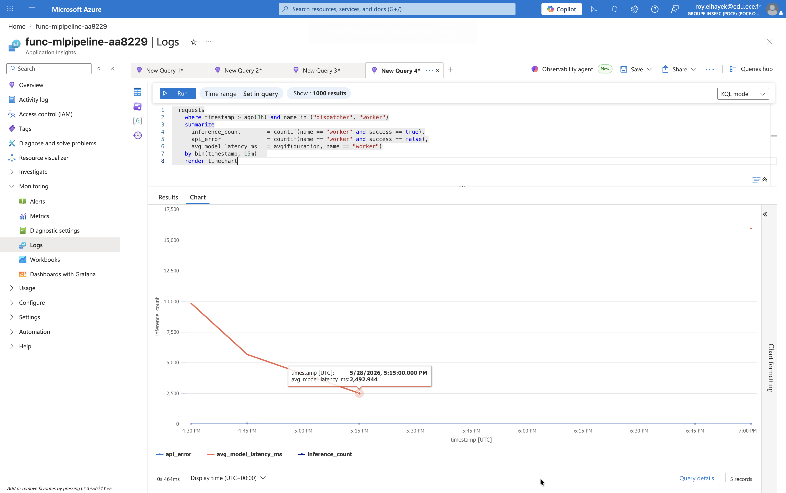

---

## Summary — every screenshot captured

| File | Source |
|------|--------|
| `docs/demo/ci_run_success.png` | GitHub Actions tab |
| `docs/demo/deploy_run_with_approval.png` | GitHub Actions tab |
| `docs/demo/github_environments.png` | GitHub repo settings |
| `docs/demo/blob_upload.png` | Azure Portal — Storage |
| `docs/demo/dispatcher_invocations.png` | App Insights Logs (Function App) |
| `docs/demo/worker_invocations.png` | App Insights Logs (Function App) |
| `docs/demo/cosmos_record.png` | Cosmos DB Data Explorer |
| `docs/demo/dashboard_live.png` | `localhost:5173` with live Azure backend |
| `docs/demo/alerts_configured.png` | Azure Monitor — Alert rules |
| `docs/demo/alert_fired.png` | Azure Monitor — Alert state |
| `docs/demo/custom_metrics_chart.png` | App Insights Logs (Function App) |
| `docs/kql/inference_per_hour.png` | App Insights Logs |
| `docs/kql/top5_slowest.png` | App Insights Logs |
| `docs/kql/http_status_distribution.png` | App Insights Logs |

All 14 screenshots present in the repository — D3 deliverable complete.
